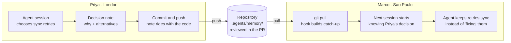
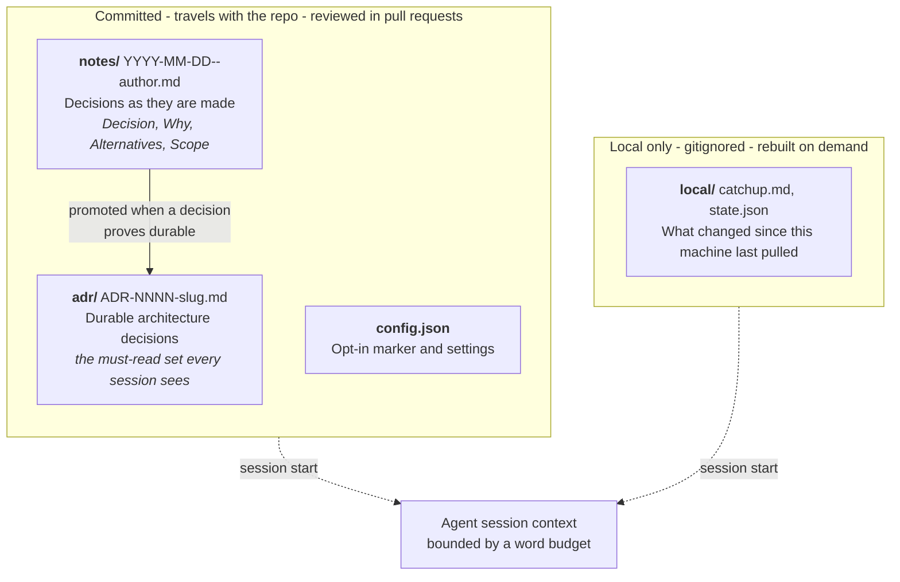

# agentmemory

[](https://github.com/davecthomas/agentmemory/actions/workflows/ci.yml)

**Shared decision memory for teams working with coding agents.** Plain Markdown, committed to your repository, injected into every agent session on the team.

---

## The problem AI created

An agent is sharp inside one session and blank at the start of the next. A team agrees during one conversation and drifts after it. Pairing every developer with an agent widens both gaps at once.

Consider a four-person team. Before agents, they made perhaps a dozen decisions a week that shaped the codebase. Standups and code review carried most of them. Now each developer ships several times as much, and the decisions come with it: which library, which trade-off, which approach they tried and abandoned. Standups and Slack cannot absorb that rate. Meanwhile the record of each decision lives in a conversation that disappears when the session closes. The reasoning, the alternatives, and the constraint that forced it go with it.

Three things follow, and every team pairing with agents hits them.

**Work gets redone.** Your agent spent an hour last Tuesday on the retry path. It must stay synchronous, because the queue library loses state across restarts. That conversation is gone. This week another session looks at the same code. It sees a synchronous call that "should" be async, and helpfully rewrites it.

**Teams diverge faster than they used to.** Four developers with four agents produce four sets of assumptions about the same codebase. Agents work fast and sound confident, so the divergence compounds before anyone notices. Whoever finds it is usually debugging production at the time.

**Review shows the what, never the why.** A pull request displays the diff. The reasoning behind it stayed in a chat window the reviewer cannot open. Reviewers approve changes without the context that would let them push back.

None of this is an agent failure. Agents do what you ask inside a session. The gap sits between sessions, and between people.

## Why your AI provider does not fill this gap

Every major assistant now ships something called memory, and instruction files like `AGENTS.md` and `CLAUDE.md` are standard. Neither covers this.

| | Provider memory (ChatGPT, Claude, Copilot) | Instruction files (`AGENTS.md`, `.cursorrules`) | agentmemory |
|---|---|---|---|
| Scoped to | one person's account | the repository | the repository |
| Shared with teammates | no | yes | yes |
| Versioned with the code | no | yes | yes |
| Visible in a pull request | no | only when edited | yes, alongside the change it explains |
| Records the reasoning behind a decision | no | no | yes, with alternatives and scope |
| Grows without hand-maintenance | yes | no | yes |
| Survives switching vendors | no | partly | yes, it is Markdown in git |

Provider memory accumulates but stays personal, opaque, and held on one vendor's servers. Instruction files travel with the repository and get versioned, but they stay static: someone has to remember to update them. They also describe how an agent should behave, while leaving the reasons the code took its present shape unrecorded.

agentmemory occupies the space between. It lives in your repository like an instruction file, and it accumulates on its own like provider memory. Because it is Markdown in your repository, it moves with `git push` and `git pull`, gets reviewed like code, and outlives whichever agent wrote it.

## How a decision travels between teammates

One developer's agent records a decision. It reaches every other developer's agent through git, with no service in between.



Marco never read the note. His agent did, at session start, and acted on it. That is the loop no provider offers: **one agent's reasoning becomes another agent's starting context, across people, machines, and time zones.**

Onboarding uses the same loop. A developer joining in month nine clones the repository, and their first session already carries the decisions from months one through eight.

## What gets stored

Two durable artifacts, both committed. One local cache, never committed.



Must-read ADRs are injected in relevance order: those tagged foundational first, then those whose tags match what this branch has touched, then the rest. The word budget truncates the tail, so what falls off is what this session is least likely to need, and the `memory` skill still finds it.

Notes are cheap and many: three lines written the moment someone makes a choice. ADRs are few and deliberate: a note gets promoted once a decision proves it governs the codebase. Every session receives the ADR index, the decisions from must-read ADRs, and recent notes. A configurable word budget bounds the whole block, so memory never crowds out the work.

## How memory gets captured

Capture happens where someone is already explaining a decision, so nobody keeps a second journal.

```
Session starts        ->  SessionStart hook injects: ADR index, must-read ADR
                          decisions, the last 3 days of notes in full, decision
                          lines for the rest, catch-up. Bounded to a word budget.

Agent makes a         ->  memory-note skill appends 3 lines to
non-obvious choice        .agents/memory/notes/YYYY-MM-DD--<author>.md (staged)

Turn ends with repo   ->  Stop hook asks once per session: record a note with
changes but no note       memory-note, or say no decision was made. When a note
                          was written, it says so instead. No LLM spawn.

Developer commits     ->  post-commit hook writes a note when the commit touches
                          docs/**, carries a "Decision:" line, or its body explains
                          a why (because / so that / instead of). The commit body
                          becomes the note.

Note proves durable   ->  adr-promoter writes ADR-NNNN-<slug>.md, rebuilds INDEX.md

Before the PR          ->  memory-commit gathers outstanding memory into its own
                          commit, in the same pull request as the code

Teammate pulls        ->  post-merge hook writes local/catchup.md from git log

Anyone asks "why?"    ->  memory skill searches ADRs, notes, docs, git log -- <path>
```

No hook spawns an LLM, so capture costs nothing per turn. The system never commits or pushes on its own. Memory becomes collaborative when a person pushes it, in the same pull request as the code it explains.

## What this is not

Honest limits, so you can judge whether it fits.

- **Not a wiki.** ADRs record the decisions that govern code. Documentation belongs wherever you already keep it. Ten to thirty ADRs is a healthy repository; three hundred means the bar slipped.
- **Not automatic understanding.** It records decisions a person or agent chose to record. A team that writes nothing gets a memory of nothing.
- **Not a service.** No database, no vector store, no embeddings, no network calls. This is a deliberate constraint: the repository owns the memory, so it works offline, survives vendor changes, and is auditable in a diff.
- **Not multi-vendor yet.** v0.5 wires Claude Code only. Scripts install under agent-neutral paths so another runtime can be added, and the Markdown is already readable by any agent that can read files.
- **Not free of context cost.** The injected block runs roughly 1,500 to 2,500 words. That is the price of every session starting informed, and the budget is yours to set.

## Getting started

Requires Python 3.13+, Git, and Claude Code.

```bash
git clone git@github.com:davecthomas/agentmemory.git
cd agentmemory
./install.sh            # --dry-run to preview, --force to replace non-symlink skill dirs
```

The installer copies the scripts to `~/.agent/shared-repo-memory/`, the skills to `~/.agent/skills/` with symlinks from `~/.claude/skills/`, and adds `SessionStart`, `PostCompact`, and `Stop` hooks to `~/.claude/settings.json`. Restart open Claude Code sessions afterwards.

Installing turns nothing on. Every hook exits silently in a repository that has not opted in.

### Opt a repository in

`./install.sh` put the tooling on your machine and turned nothing on. Each repository opts in separately, from a Claude Code session inside it.

**1. Open a new session in the repository you want memory in.**

```bash
cd ~/code/your-other-repo   # your repository, not the agentmemory checkout
claude                      # a new session, so it loads the hooks you just installed
```

A session you opened before running `./install.sh` does not have the hooks. Start a fresh one.

**2. Turn it on.** In that session, run:

```
/agentmemory init
```

or say "turn on agentmemory for this repo".

This writes `.agents/memory/config.json`, the opt-in marker, and creates `adr/`, `notes/`, and `local/`. It also adds a managed block to `.gitignore`, generates the git hooks under `.githooks/`, and sets `core.hooksPath`. When the repository has an `AGENTS.md` or `CLAUDE.md`, it adds a "Decision memory" block there too, so an agent without agentmemory still learns the convention.

**3. Commit the opt-in.** In the same session:

```
/memory-commit
```

It gathers the memory directory and the opt-in edits to `.gitignore` and `AGENTS.md`, and commits them with a message explaining what the directory is. It leaves any file where you have your own uncommitted edits, and says so.

Committing `config.json` opts the whole team in. Teammates who never install agentmemory still see the Markdown in every pull request. Teammates who install it get the memory in their agent's context automatically.

**4. Restart the session, then check.** `SessionStart` reads memory as a session opens, so the session that ran `init` does not carry it yet. Exit, open a new one, and run:

```
/agentmemory status
```

Expect `Opted in: yes` and `Wiring: complete`.

**5. Seed it, when the repository already has history.** Run `/memory-bootstrap`. It mines design docs and commit messages for the decisions that still govern the code, then promotes the strongest few.

`/agentmemory off` reverses the repository wiring and leaves the memory files in place.

### Rolling it out to a team

1. One person opts the repository in and runs `/memory-bootstrap`, then opens a pull request with the seeded ADRs. Reviewing that pull request is how the team agrees on what its decisions are.
2. Teammates run `./install.sh` once per machine. Nothing else changes about how they work.
3. Set `decision_surfaces` in `config.json` to the paths where your design discussions live (`docs/**` by default, or `rfcs/**`, `architecture/**`).
4. After a fortnight, run `/agentmemory status` and read `news`. If notes are not accumulating, the bar for what counts as a decision is probably too high.

## Layout

```
<repo>/.agents/memory/
├── config.json          # opt-in marker + settings
├── adr/
│   ├── INDEX.md         # rebuilt by promote-adr.py
│   └── ADR-NNNN-<slug>.md
├── notes/
│   └── YYYY-MM-DD--<author>.md   # append-only decision notes, one file per person per day
└── local/               # gitignored: catchup.md, state.json
```

`config.json` defaults:

```json
{
  "decision_surfaces": ["docs/**"],
  "context_budget_words": 2500,
  "notes_window_days": 14,
  "notes_full_days": 3,
  "foundational_tags": ["storage", "collaboration", "curation"]
}
```

Per-author note filenames mean two people writing notes on the same day never touch the same file, so decision memory does not create merge conflicts.

## Skills

| Skill | Use |
|---|---|
| `adr-promoter` | Turn a note (or stated decision) into an ADR |
| `agentmemory` | `init`, `status`, `off` for the current repository |
| `memory` | "What do we know about X?" |
| `memory-bootstrap` | Seed ADRs from existing docs and commits |
| `memory-commit` | Commit outstanding memory as its own commit in this PR |
| `memory-note` | Record a decision the moment you make it |
| `news` | What changed in memory since you last looked |

### For humans

The scripts work without an agent. A git alias makes a note one command:

```bash
git config --global alias.note '!python3 "$HOME/.agent/shared-repo-memory/memory-note.py" --decision'
git note "Use a queue for retries" --why "cron cannot hold retry state"
```

`memory-query.py <topic>` and `memory-news.py` answer the same questions the skills do.

## Scripts

All in `scripts/shared-repo-memory/`, installed to `~/.agent/shared-repo-memory/`:

| Script | Role |
|---|---|
| `bootstrap-repo.py` | `--init` opts a repository in; otherwise repairs wiring. |
| `catchup.py` | Git hook. Writes `local/catchup.md` from memory changes since last seen. |
| `check-memory.py` | Git hook (pre-commit). Structural checks on `.agents/memory/`. |
| `commit-capture.py` | Git hook. Note from a decision-bearing commit. |
| `install.py` / `uninstall.py` | Machine scope; `uninstall.py --repo` for repository scope. |
| `memory-bootstrap.py` | Backs `memory-bootstrap`: ranked decision candidates from docs and commit bodies. |
| `memory-commit.py` | Stage uncommitted memory and draft its commit message. |
| `memory-news.py` | Backs `news`: catch-up, recent notes, newest ADRs, recent commits, ADR-promotion suggestions. |
| `memory-note.py` | Append a note. |
| `memory-query.py` | Search ADRs, notes, docs, path history; ranked, `--json`. |
| `memory-status.py` | Backs `/agentmemory status`: wiring, counts, context size. |
| `post-compact.py` | Hook. Re-injects context after compaction. |
| `promote-adr.py` | Write an ADR, rebuild the index. `--from-note`, `--supersedes`, `--reindex`. |
| `session-start.py` | Hook. Repairs wiring, injects context. `--print-context` prints the block. |
| `turn-nudge.py` | Hook (`Stop`). Once per session, asks for a note when work went unrecorded. |

Together they are about 2,100 lines of Python with no dependencies beyond the standard library.

## Evals

Memory has to earn its context budget, so two checks measure it.

- `scripts/shared-repo-memory/check-memory.py` runs in the pre-commit hook and rejects a commit whose ADR index, links, frontmatter, note format, or budget is broken.
- `evals/run_eval.py` asks `claude -p`, with tools disabled, the questions in `evals/questions.json` both with and without the session-start context. It scores coverage and fails when memory does not beat the baseline. Six hold-out questions come from git history, so they expose gaps the ADRs leave as well as what memory covers.

```bash
python3 evals/run_eval.py --quick         # six questions, about a minute
python3 evals/run_eval.py                 # all questions
python3 evals/run_eval.py --dry-run       # prompt sizes only
```

Latest result: [evals/results/latest.md](evals/results/latest.md).

## Uninstall

```bash
./uninstall.sh                # machine: hooks, skills, scripts
./uninstall.sh --repo         # this repository: hooks, hooksPath, .gitignore block, local/
./uninstall.sh --repo --purge-memory   # also stage git rm --cached .agents/memory
./uninstall.sh --dry-run
```

Uninstall removes only what it can identify as its own; edited hooks and user-added settings survive. Committed memory stays in the repository unless you pass `--purge-memory`.

## Development

```bash
poetry install
poetry run pytest scripts/shared-repo-memory/test -q
poetry run black . && poetry run ruff check scripts/ evals/
```

`scripts/shared-repo-memory/project-pre-commit.sh` runs black, ruff, the tests, and `check-memory.py` on every commit through the generated pre-commit hook.

Current version: `0.5.0`. The v0.5 rebuild and the audit behind it are in [docs/v0.5-decision-memory-plan.md](docs/v0.5-decision-memory-plan.md).
