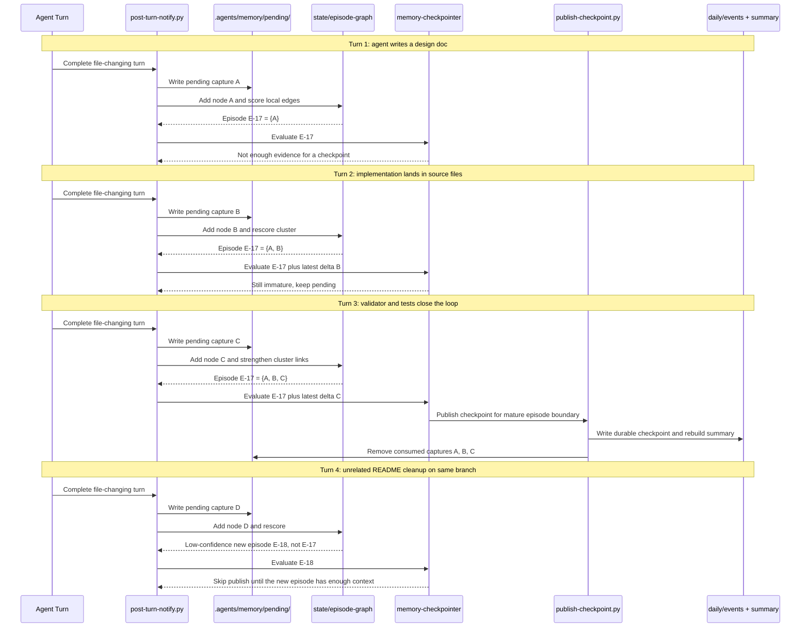

# Gestalt 2.0 Episode Graph Design

## Purpose

Define the next-level association model for shared repo memory so durable
checkpoint publication can reason about semantically related episodes instead of
relying on the current fallback of same branch plus coarse path overlap.

This document is the design note for GitHub issue #4.

The issue title says "workstream graph" because that was the initial shorthand.
This design note prefers `episode graph` because the bounded semantic unit we
want to publish from is an episode, not an open-ended stream of work.

## Problem

The current checkpoint pipeline already improved the trust boundary by moving
from turn-level publication to pending captures plus bounded episode
evaluation. That solved the worst failure mode: publishing low-signal memory
directly from one turn.

The remaining weakness is episode association when the runtime does not provide
an explicit `thread_id`.

Today the fallback logic is intentionally simple:

- same branch
- coarse path overlap
- small recent window

That is bounded and deterministic, but it is still too weak in both directions:

- unrelated work on the same branch can look related
- one real architectural effort can look fragmented when it moves across
  multiple files, tests, docs, or boundaries

The result is that checkpoint publication still risks evaluating the wrong
episode, especially in branch-scoped fallback mode.

## Terminology

The model should stay explicit about raw inputs versus derived state:

- `turn`: one prompt-response interaction or hook invocation; provenance only
- `pending capture`: the raw per-turn local capture written under
  `.agents/memory/pending/`
- `episode graph`: derived local association state built from pending captures
- `episode cluster`: one candidate bounded episode derived from that graph
- `checkpoint`: durable published memory emitted from a mature episode cluster

`workstream` is not wrong, but it suggests something broader and longer-lived
than the bounded publication unit. `episode` is the better term for the local
cluster that the checkpointer evaluates.

## Big Idea

Replace branch/path-only fallback grouping with a local weighted episode graph.

Each pending capture becomes a node. The system computes weighted edges between
captures using repo-grounded signals, then clusters those nodes into candidate
episodes. Durable checkpoint publication evaluates the active cluster and the
latest delta within that cluster rather than evaluating only a short bundle
around the latest turn.

The graph stays local-only and privacy-safe. It is a staging and reasoning
model, not a committed artifact.

## Graph Model

### Nodes

Each pending capture under `.agents/memory/pending/YYYY-MM-DD/` is one graph
node.

Each node should carry only repo-grounded metadata already allowed in the
privacy-safe pending path, such as:

- timestamp
- branch
- `thread_id` and `turn_id`
- touched files
- touched design docs
- diff summary
- verification signals
- ADR references
- recent summary references

No raw user prompt text is required.

These pending captures are the raw nodes. The graph manifests, edge scores, and
cluster summaries are not raw inputs; they are derived local state built from
those captures.

### Edge Signals

Edge weights should be computed from multiple signals rather than one fallback
rule. The initial signal set should include:

- same explicit `thread_id`
- same branch
- overlapping files
- overlapping directories or subsystem paths
- shared design docs
- shared ADR references
- shared tests or validators touched
- temporal proximity
- shared issue IDs in branch names, commit messages, or doc filenames
- repeated movement in the same subsystem boundary

Each signal should contribute a bounded weight. The scoring model does not need
to be perfect, but it must be inspectable and deterministic.

### Candidate Episode Clusters

After scoring edges, the system should derive candidate episode clusters.

The first pass should allow one pending capture to have:

- one primary episode-cluster assignment
- zero or more secondary candidate associations when ambiguity is high

This matters because some turns legitimately bridge two adjacent efforts, such
as design plus implementation or hook plus validator changes.

## Folder Structure

`logs/` is the wrong parent for graph manifests and checkpoint-context data.
Logs should remain human-readable diagnostic output only. Derived local state
used as processing input should live under `state/`.

Recommended first-pass layout:

```text
.agents/memory/
  adr/
  daily/
  pending/                         # raw per-turn graph nodes
  state/
    checkpoint-context/            # derived local evaluator inputs
    episode-graph/
      episodes/
        <episode-id>.json          # candidate episode manifests
  logs/
    bootstrap.log
    enrichment.log
```

Notes:

- `pending/` remains the raw local node store.
- `state/checkpoint-context/` is a better home than `logs/checkpoint-context/`
  because these manifests are structured derived inputs, not logs.
- `state/episode-graph/episodes/` should hold the inspectable cluster manifests.
- If edge-score debugging needs its own files later, that can be added under
  `state/episode-graph/`, but the first pass can keep those scores inline in the
  episode manifest.

## Local State

The graph and clustering output should stay under local-only state, for
example:

```text
.agents/memory/state/episode-graph/episodes/<id>.json
```

Each manifest should describe:

- cluster identifier
- member pending captures
- edge scores or summarized reasons
- primary affected subsystem hints
- cluster status such as active, ambiguous, split-candidate, or closed
- last evaluated capture
- latest published checkpoint, if any

These manifests are not published memory. They are local reasoning state used
to decide when durable publication is justified.

## Sample Multi-Turn Flow

The sequence below shows how a local episode graph should behave across several
turns in one realistic branch-scoped fallback scenario.



## Publication Model

The publisher should stop treating the latest pending capture as the center of
the world.

Instead, checkpoint evaluation should reason about:

1. the active episode cluster
2. the latest delta inside that cluster
3. whether the cluster has crossed a meaningful checkpoint boundary

Meaningful checkpoint boundaries can include:

- the first durable architectural move in the cluster
- a design doc plus implementation landing together
- a validator, test, or hook that closes the loop on a broader effort
- a significant direction change inside the cluster
- clear closure of the cluster

This changes publication from:

- "after every file-changing turn, try to publish"

to:

- "publish when the episode state changes meaningfully"

That is the core gestalt 2.0 shift.

## Three-Layer Architecture

### 1. Deterministic local clustering

This layer owns the graph and the first association pass.

Responsibilities:

- read pending capture metadata
- compute weighted edges
- assign captures to candidate episode clusters
- maintain local manifests
- stay bounded and deterministic

### 2. Background semantic labeling

This layer remains asynchronous and subagent-driven.

Responsibilities:

- read one candidate episode manifest plus referenced repo files
- infer the broader goal, subsystem surface, and latest outcome
- split, reject, or relabel a deterministic cluster when the graph got it wrong

The semantic layer should correct deterministic mistakes, not replace the local
graph entirely.

### 3. Checkpoint publisher

This layer remains the final trust boundary.

Responsibilities:

- publish only when the labeled cluster is coherent and mature enough
- reject weak or mechanically plausible but semantically poor candidates
- leave pending captures unpublished when the cluster is still immature

## Why This Is Better

The local graph should separate cases the current fallback cannot:

- same branch, same folder, different intent
- different files, but clearly the same broader architectural effort

That improves both precision and recall:

- fewer unrelated captures bundled together
- fewer truly related captures split apart

The expected result is more trustworthy checkpoint timing and more coherent
published memory.

## Privacy Constraints

Gestalt 2.0 must preserve the current privacy rules.

Allowed inputs:

- pending capture metadata
- touched files
- diff summaries
- design docs
- ADRs
- recent summaries
- tests and validator signals

Disallowed inputs:

- raw user prompt text
- raw assistant-response passthrough
- reconstructed conversation transcripts

If the graph plus repo-grounded context are not enough to justify publication,
the system should publish nothing.

## Bounded First Pass

The first implementation should stay intentionally bounded.

In scope:

- local graph only
- bounded recent history
- deterministic weighted scoring
- local episode manifests
- asynchronous semantic labeling
- checkpoint publication at cluster transitions

Out of scope:

- global or remote clustering
- unbounded history scans
- perfect semantic grouping
- full contradiction reconciliation across historical checkpoints
- aggressive cluster merge and split automation

## Future Directions

More advanced follow-on work could add:

- cluster split and merge over time
- closure detection for finished episodes
- contradiction detection when later work changes the earlier story
- checkpoint compaction so one long effort does not spray many similar shards

Those are useful, but they are not required for the first graph-based
association pass.

## Recommended First Implementation Sequence

1. Define the episode-manifest schema under
   `.agents/memory/state/episode-graph/episodes/`.
2. Add deterministic weighted edge scoring for pending captures.
3. Replace branch/path-only fallback episode selection with cluster selection.
4. Move checkpoint-context manifests under `.agents/memory/state/`.
5. Update the checkpointer context to reference the active cluster plus latest
   delta.
6. Publish only at meaningful cluster transitions.
7. Add regression fixtures covering:
   - same branch, unrelated fixes
   - different files, same architectural effort
   - design doc plus implementation landing together
   - validator or test closing the loop

## Success Criteria

Gestalt 2.0 is successful when:

- branch-scoped fallback no longer depends only on same-branch plus path overlap
- local candidate episode clusters are visible and inspectable in manifests
- checkpoint publication is triggered by meaningful cluster transitions
- privacy guarantees remain intact
- published checkpoints become more coherent without adding unbounded latency or
  turning the system into a research project
